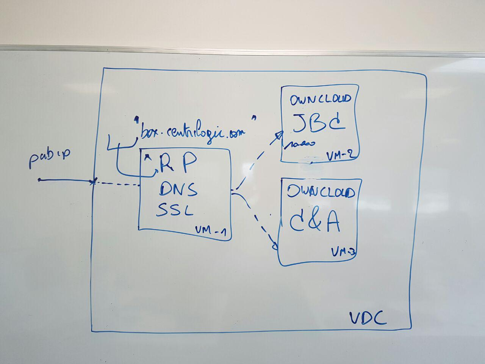

# Easy OwnCloud deployment via AYS

Each OwnCloud will be hosted in its own VDC. The OwnCloud will be hosted by 1 virtual machine with a scallable storage setup through [BTRFS](https://en.wikipedia.org/wiki/Btrfs)

## Input parameters that customers will need to pass when buying an OwnCloud system

- domain (optional)
- ItsYou.Online organisation of people allowed to login on the OwnCloud instance
- ItsYou.Online organisation of people allowed to administer the OwnCloud instance

# Dockers

## Infrastructure docker (RP/SSL)

The infrastructure virtual machine will be running the following dockers:
- Caddy docker
  - SSL termination
  - Reverse proxy mapping incomming requests to the OwnCloud docker

## OwnCloud docker
Runs the OwnCloud server application

## MariaDB docker
Runs the database supporting the OwnCloud

# Storage

## Storage setup
- 20GB Bootdisk
- X number of data volumes of 1TB depending on the requested capacity supporting a single btrfs filesystem mounted on /data
  - /data/cfg will contain the OwnCloud configuration
  - /data/db will be used for the data directory of the PerconaDB docker
  - /data/storage will be used for the OwnCloud file storage

## Dynamic storage capacity
The cockpit will monitor the amount of free diskpace in the /data mount every hour. If a running OwnCloud runs under 100GB free diskspace, the capacity will be upgraded by adding a disk to the vm and also to the btrfs filesystem in the vm. This action is completely automatic, and the virtual machine should not be brought down for this action.
Using the cockpit API, the exact amount of storage in the S3 container can be read.

## Cockpit API results after deploying blueprint
- Technical webdav username, password, ... necessary for the OVF import procedure.
