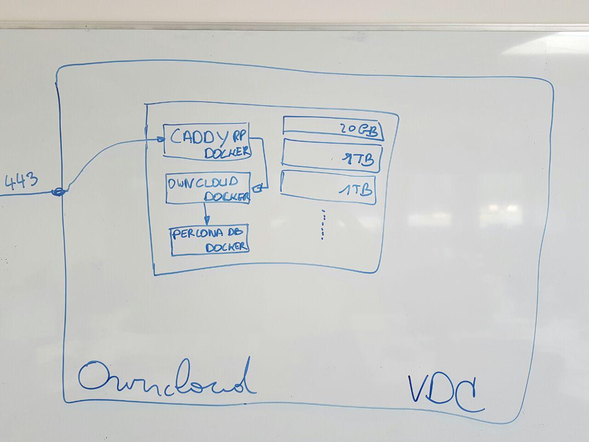

# Easy OwnCloud deployment via AYS

Each OwnCloud will be hosted in its own VDC. The OwnCloud will be hosted by 1 virtual machine with a scallable storage setup through [BTRFS](https://en.wikipedia.org/wiki/Btrfs)

## Input parameters that customers will need to pass when buying an OwnCloud system

- domain
- capacity in GB
- ItsYou.Online organisation of people allowed to login on the OwnCloud instance
- ItsYou.Online organisation of people allowed to administer the OwnCloud instance

# Dockers

## Infrastructure docker (RP/SSL)

The infrastructure virtual machine will be running the following dockers:
- Caddy docker
  - SSL termination
  - Reverse proxy mapping incomming requests to the OwnCloud docker

## OwnCloud docker
Runs the OwnCloud server application

### OwnCloud virtual machines will be running the following dockers:
- OwnCloud
- PerconaDB with TokuDB

### Storage in the VM is setup as follows:
- 20GB Bootdisk
- X number of data volumes depending on the requested capacity supporting a single btrfs filesystem mounted on /data
  - /data/cfg will contain the OwnCloud configuration
  - /data/db will be used for the data directory of the PerconaDB docker
  - /data/storage will be used for the OwnCloud file storage

### Storage capacity upgrade
If a running OwnCloud runs out of storage, the capacity can be upgraded by adding a disk to the vm and also to the btrfs filesystem in the vm. The virtual machine should not be brought down for this action.
